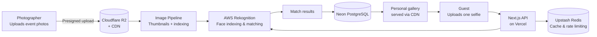

# Regapic — Architecture Overview

**Live product:** [regapic.com](https://regapic.com)

Regapic is a facial-recognition SaaS platform for events. Guests upload a single selfie and instantly receive a personal gallery containing only the photos they appear in. I designed, built, and operate the entire system solo: architecture, full-stack code, cloud infrastructure, and go-to-market.

This document describes how the system is built. The source code is private (it is a commercial product), but the architecture and the engineering decisions behind it are documented here.

## System at a Glance

## Stack and Why Each Piece Was Chosen

| Layer | Technology | Why |
|---|---|---|
| Frontend + API | Next.js (TypeScript) on Vercel | One codebase for UI and API routes, serverless scaling per event spike, zero server maintenance for a solo builder |
| Styling | Tailwind CSS | Fast iteration, consistent design system without a designer |
| Face recognition | AWS Rekognition | Managed face indexing and matching. Building an in-house model made no sense for a one-person team, and Rekognition's per-call pricing matches an event-based workload |
| Object storage + CDN | Cloudflare R2 + CDN | Zero egress fees, which is the single biggest cost factor when serving thousands of photos per event. This choice is central to the near-zero marginal cost per event |
| Database | Neon PostgreSQL | Serverless Postgres, scales to zero between events, branching for safe schema changes |
| Cache and rate limiting | Upstash Redis | Serverless Redis with per-request pricing, protects the API during guest-upload spikes |

## The Image Pipeline

The core engineering challenge: an event produces thousands of photos, and hundreds of guests all query them within a short window (during and right after the event).

1. **Presigned uploads.** Photographers upload directly to R2 using presigned URLs. Files never pass through the application server, so upload throughput does not depend on server capacity.
2. **Automatic thumbnail generation.** Every photo gets processed into web-optimized thumbnails so galleries load fast on mobile connections at venues.
3. **Face indexing.** Each photo is indexed in Rekognition, mapping detected faces to the event's face collection.
4. **Selfie matching.** A guest's selfie is searched against the event collection. Matches are stored in PostgreSQL so repeat visits read from the database, not from Rekognition (cost control).
5. **Layout-stable galleries.** Galleries render with reserved image dimensions, so thousands of images scroll smoothly without layout shift.

## Cost Architecture

The system was designed so that each additional event costs almost nothing to serve:

- R2's zero egress means serving photos is free at the delivery layer.
- Serverless compute (Vercel, Neon, Upstash) scales to zero between events.
- Rekognition results are cached in PostgreSQL, so each face is matched once, not on every gallery view.

## Business Layer

Beyond the code, I own the full commercial side: pricing, a CRM pipeline of 100+ leads, legal compliance (biometric data handling requires explicit consent flows), and direct sales to photographers. The business serves photographers (B2B) and event clients (B2C).

## Contact

Ofir Barazani
[linkedin.com/in/ofir-barazani](https://www.linkedin.com/in/ofir-barazani) · ofirbarazani1@gmail.com
